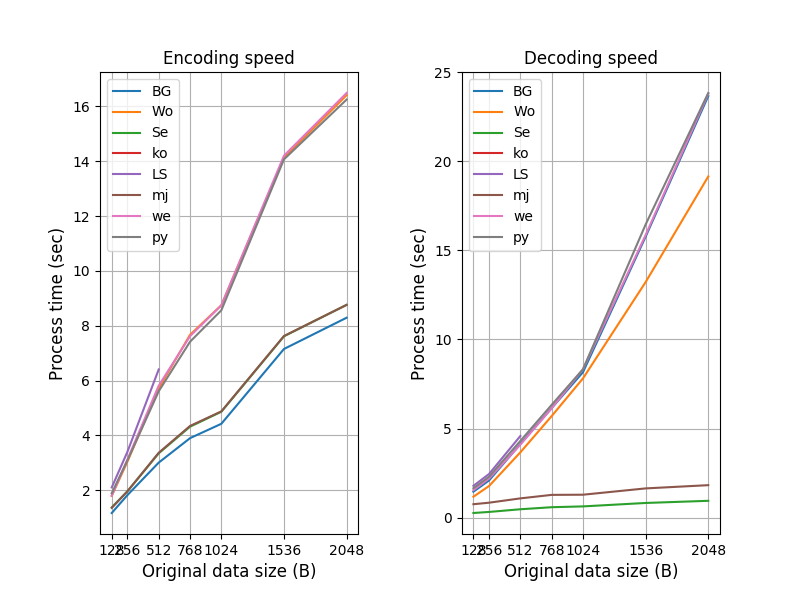

Base62 Code comparison
======================

https://stackoverflow.com/questions/1119722/base-62-conversion

    How would you convert an integer to base 62.

## Result of my comparison (in brief)

Note: binary encoding, not string.



```
code       BG Wo Se ko LS mj we py
encode     1  2  1  1  1  1  1  1 : data type that can be encoded.
tolerance  1  1  1  3  2  1  1  1 : data size that can be encoded.
size       2  1  2  4  3  2  2  2 : encoded data size.
en speed   1  3  3  3  4  2  3  3 : encoding speed.
de speed   4  3  1  4  5  2  4  4 : decoding speed.
Total      9  10 8  15 15 8  11 11
type       A  B  A  C  D  A  A  A : encoded data type.
```

Smaller point is better.
In single code, mj looks the best code.

Both BG and Se make same vaule when data encoded.
You can use BG for encoding, and Se for decoding.

For example,
```
% ./eval.py -c BG -i data/ff1024.dmp -o encoded.txt
% ./eval.py -c Se -i encoded.txt -o decoded.dmp -d
% cmp decoded.dmp data/ff1024.dmp
```

This combination looks the most effective.

## Why did I compare the codes ?

I wanted a base62 binary encoder/decoder.

Asked google in tens of minutes.
I found a thread discussing base64 in python at Stackoverflow.

    "How would you convert an integer to base 62."
    https://stackoverflow.com/questions/1119722/base-62-conversion

Several codes were submitted.
So, I tryed to compare them and to find which one was the best in terms
of encoded size, speed, and memory consumption.

## Post-Conclusion of this work...

However, the purpose of the thread was to find a way to encode an integer.
So, I noticed that they didn't care a binary encoding/decoding.

If I use one of them, I need to convert a binary data into an integer,
then I can encode it into a base62 string with the code,
and can decode the string into an integer.
But, I can't get the original binary data from the integer
because the original binary size has been lost.

After all, I decided to use Devid's [base58](https://github.com/keis/base58) code with a bit [modification](https://raw.githubusercontent.com/tanupoo/base58/baseany/base58/__init__.py).
It can handle any type of base when you pass your alphabet.

## BASE62 string for this measurement

taken from wikipedia like below:

```
0123456789ABCDEFGHIJKLMNOPQRSTUVWXYZabcdefghijklmnopqrstuvwxyz
```

## Modifications

```
base62BG.py
    replace BASE62 into wikipedia's one.

base62Wo.py
    integer //= length
    s/base_decode/decode/
    s/base_encode/encode/

base62Se.py
    s/base_decode/decode/
    s/base_encode/encode/

base62ko.py
    replace BASE62 into wikipedia's one.
    s/toBase10/decode/
    s/toBase62/encode/

base62LS.py
    replace BASE62 into wikipedia's one.

base62mj.py
    replace BASE62 into wikipedia's one.
    s/encode_base62/encode/
    s/decode_base62/decode/

base62we.py
    dec //= 62
    range()
    s/base62_encode_i/encode/
    s/base62_decode_i/decode/

base62py.py
    https://github.com/suminb/base62
```

## Initial check

```
% ./eval.py -B
## Initial check (very short data).
### Code: BG
- Original data: b'ab'
    + Encoded string: 6U6
    + Decoded number: 24930
    + Decoded == Original: True
- Original data: b'abcd'
    + Encoded string: 1mZPsa
    + Decoded number: 1633837924
    + Decoded == Original: True
- Original data: b'\xff\xff'
    + Encoded string: H31
    + Decoded number: 65535
    + Decoded == Original: True
- Original data: b'\x00\x01'
    + Encoded string: 1
    + Decoded number: 1
    + Decoded == Original: True
- Original data: b'\x00\x00\x01'
    + Encoded string: 1
    + Decoded number: 1
    + Decoded == Original: True

### Code: Wo
- Original data: b'ab'
    + Encoded string: 65y
    + Decoded number: 24930
    + Decoded == Original: True
- Original data: b'abcd'
    + Encoded string: 1xoCdA
    + Decoded number: 1633837924
    + Decoded == Original: True
- Original data: b'\xff\xff'
    + Encoded string: f@@
    + Decoded number: 65535
    + Decoded == Original: True
- Original data: b'\x00\x01'
    + Encoded string: 1
    + Decoded number: 1
    + Decoded == Original: True
- Original data: b'\x00\x00\x01'
    + Encoded string: 1
    + Decoded number: 1
    + Decoded == Original: True

### Code: Se
- Original data: b'ab'
    + Encoded string: 6U6
    + Decoded number: 24930
    + Decoded == Original: True
- Original data: b'abcd'
    + Encoded string: 1mZPsa
    + Decoded number: 1633837924
    + Decoded == Original: True
- Original data: b'\xff\xff'
    + Encoded string: H31
    + Decoded number: 65535
    + Decoded == Original: True
- Original data: b'\x00\x01'
    + Encoded string: 1
    + Decoded number: 1
    + Decoded == Original: True
- Original data: b'\x00\x00\x01'
    + Encoded string: 1
    + Decoded number: 1
    + Decoded == Original: True

### Code: ko
- Original data: b'ab'
    + Encoded string: 6U6
    + Decoded number: 24930
    + Decoded == Original: True
- Original data: b'abcd'
    + Encoded string: 1mZPsa
    + Decoded number: 1633837924
    + Decoded == Original: True
- Original data: b'\xff\xff'
    + Encoded string: H31
    + Decoded number: 65535
    + Decoded == Original: True
- Original data: b'\x00\x01'
    + Encoded string: 1
    + Decoded number: 1
    + Decoded == Original: True
- Original data: b'\x00\x00\x01'
    + Encoded string: 1
    + Decoded number: 1
    + Decoded == Original: True

### Code: LS
- Original data: b'ab'
    + Encoded string: 6U6
    + Decoded number: 24930
    + Decoded == Original: True
- Original data: b'abcd'
    + Encoded string: asPZm1
    + Decoded number: 1633837924
    + Decoded == Original: True
- Original data: b'\xff\xff'
    + Encoded string: 13H
    + Decoded number: 65535
    + Decoded == Original: True
- Original data: b'\x00\x01'
    + Encoded string: 1
    + Decoded number: 1
    + Decoded == Original: True
- Original data: b'\x00\x00\x01'
    + Encoded string: 1
    + Decoded number: 1
    + Decoded == Original: True

### Code: mj
- Original data: b'ab'
    + Encoded string: 6U6
    + Decoded number: 24930
    + Decoded == Original: True
- Original data: b'abcd'
    + Encoded string: 1mZPsa
    + Decoded number: 1633837924
    + Decoded == Original: True
- Original data: b'\xff\xff'
    + Encoded string: H31
    + Decoded number: 65535
    + Decoded == Original: True
- Original data: b'\x00\x01'
    + Encoded string: 1
    + Decoded number: 1
    + Decoded == Original: True
- Original data: b'\x00\x00\x01'
    + Encoded string: 1
    + Decoded number: 1
    + Decoded == Original: True

### Code: we
- Original data: b'ab'
    + Encoded string: 6U6
    + Decoded number: 24930
    + Decoded == Original: True
- Original data: b'abcd'
    + Encoded string: 1mZPsa
    + Decoded number: 1633837924
    + Decoded == Original: True
- Original data: b'\xff\xff'
    + Encoded string: H31
    + Decoded number: 65535
    + Decoded == Original: True
- Original data: b'\x00\x01'
    + Encoded string: 1
    + Decoded number: 1
    + Decoded == Original: True
- Original data: b'\x00\x00\x01'
    + Encoded string: 1
    + Decoded number: 1
    + Decoded == Original: True

### Code: py
- Original data: b'ab'
    + Encoded string: 6U6
    + Decoded number: 24930
    + Decoded == Original: True
- Original data: b'abcd'
    + Encoded string: 1mZPsa
    + Decoded number: 1633837924
    + Decoded == Original: True
- Original data: b'\xff\xff'
    + Encoded string: H31
    + Decoded number: 65535
    + Decoded == Original: True
- Original data: b'\x00\x01'
    + Encoded string: 1
    + Decoded number: 1
    + Decoded == Original: True
- Original data: b'\x00\x00\x01'
    + Encoded string: 1
    + Decoded number: 1
    + Decoded == Original: True
```

## making data

```
% for s in 128 256 512 768 1024 1536 2048 ; do \
    dd if=/dev/zero ibs=$s count=1 | \
    LC_ALL=C tr "\000" "\377" > data/ff$s.dmp ; done
% head -c 1024 < /dev/random > data/rand1024.dmp
```

## encoding several size of data

```
% ./eval.py -M
executing. ./eval.py -c BG -i data/ff128.dmp -o data/ff128en-BG.txt
executing. ./eval.py -c BG -i data/ff256.dmp -o data/ff256en-BG.txt
executing. ./eval.py -c BG -i data/ff512.dmp -o data/ff512en-BG.txt
executing. ./eval.py -c BG -i data/ff768.dmp -o data/ff768en-BG.txt
executing. ./eval.py -c BG -i data/ff1024.dmp -o data/ff1024en-BG.txt
executing. ./eval.py -c BG -i data/ff1536.dmp -o data/ff1536en-BG.txt
executing. ./eval.py -c BG -i data/ff2048.dmp -o data/ff2048en-BG.txt
executing. ./eval.py -c BG -i data/rand1024.dmp -o data/rand1024en-BG.txt
executing. ./eval.py -c Wo -i data/ff128.dmp -o data/ff128en-Wo.txt
executing. ./eval.py -c Wo -i data/ff256.dmp -o data/ff256en-Wo.txt
executing. ./eval.py -c Wo -i data/ff512.dmp -o data/ff512en-Wo.txt
executing. ./eval.py -c Wo -i data/ff768.dmp -o data/ff768en-Wo.txt
executing. ./eval.py -c Wo -i data/ff1024.dmp -o data/ff1024en-Wo.txt
executing. ./eval.py -c Wo -i data/ff1536.dmp -o data/ff1536en-Wo.txt
executing. ./eval.py -c Wo -i data/ff2048.dmp -o data/ff2048en-Wo.txt
executing. ./eval.py -c Wo -i data/rand1024.dmp -o data/rand1024en-Wo.txt
executing. ./eval.py -c Se -i data/ff128.dmp -o data/ff128en-Se.txt
executing. ./eval.py -c Se -i data/ff256.dmp -o data/ff256en-Se.txt
executing. ./eval.py -c Se -i data/ff512.dmp -o data/ff512en-Se.txt
executing. ./eval.py -c Se -i data/ff768.dmp -o data/ff768en-Se.txt
executing. ./eval.py -c Se -i data/ff1024.dmp -o data/ff1024en-Se.txt
executing. ./eval.py -c Se -i data/ff1536.dmp -o data/ff1536en-Se.txt
executing. ./eval.py -c Se -i data/ff2048.dmp -o data/ff2048en-Se.txt
executing. ./eval.py -c Se -i data/rand1024.dmp -o data/rand1024en-Se.txt
executing. ./eval.py -c ko -i data/ff128.dmp -o data/ff128en-ko.txt
executing. ./eval.py -c ko -i data/ff256.dmp -o data/ff256en-ko.txt
ERROR: OverflowError: integer division result too large for a float
executing. ./eval.py -c ko -i data/ff512.dmp -o data/ff512en-ko.txt
ERROR: OverflowError: integer division result too large for a float
executing. ./eval.py -c ko -i data/ff768.dmp -o data/ff768en-ko.txt
ERROR: OverflowError: integer division result too large for a float
executing. ./eval.py -c ko -i data/ff1024.dmp -o data/ff1024en-ko.txt
ERROR: OverflowError: integer division result too large for a float
executing. ./eval.py -c ko -i data/ff1536.dmp -o data/ff1536en-ko.txt
ERROR: OverflowError: integer division result too large for a float
executing. ./eval.py -c ko -i data/ff2048.dmp -o data/ff2048en-ko.txt
ERROR: OverflowError: integer division result too large for a float
executing. ./eval.py -c ko -i data/rand1024.dmp -o data/rand1024en-ko.txt
ERROR: OverflowError: integer division result too large for a float
executing. ./eval.py -c LS -i data/ff128.dmp -o data/ff128en-LS.txt
executing. ./eval.py -c LS -i data/ff256.dmp -o data/ff256en-LS.txt
executing. ./eval.py -c LS -i data/ff512.dmp -o data/ff512en-LS.txt
executing. ./eval.py -c LS -i data/ff768.dmp -o data/ff768en-LS.txt
ERROR: RecursionError: maximum recursion depth exceeded in comparison
executing. ./eval.py -c LS -i data/ff1024.dmp -o data/ff1024en-LS.txt
ERROR: RecursionError: maximum recursion depth exceeded in comparison
executing. ./eval.py -c LS -i data/ff1536.dmp -o data/ff1536en-LS.txt
ERROR: RecursionError: maximum recursion depth exceeded in comparison
executing. ./eval.py -c LS -i data/ff2048.dmp -o data/ff2048en-LS.txt
ERROR: RecursionError: maximum recursion depth exceeded in comparison
executing. ./eval.py -c LS -i data/rand1024.dmp -o data/rand1024en-LS.txt
ERROR: RecursionError: maximum recursion depth exceeded in comparison
executing. ./eval.py -c mj -i data/ff128.dmp -o data/ff128en-mj.txt
executing. ./eval.py -c mj -i data/ff256.dmp -o data/ff256en-mj.txt
executing. ./eval.py -c mj -i data/ff512.dmp -o data/ff512en-mj.txt
executing. ./eval.py -c mj -i data/ff768.dmp -o data/ff768en-mj.txt
executing. ./eval.py -c mj -i data/ff1024.dmp -o data/ff1024en-mj.txt
executing. ./eval.py -c mj -i data/ff1536.dmp -o data/ff1536en-mj.txt
executing. ./eval.py -c mj -i data/ff2048.dmp -o data/ff2048en-mj.txt
executing. ./eval.py -c mj -i data/rand1024.dmp -o data/rand1024en-mj.txt
executing. ./eval.py -c we -i data/ff128.dmp -o data/ff128en-we.txt
executing. ./eval.py -c we -i data/ff256.dmp -o data/ff256en-we.txt
executing. ./eval.py -c we -i data/ff512.dmp -o data/ff512en-we.txt
executing. ./eval.py -c we -i data/ff768.dmp -o data/ff768en-we.txt
executing. ./eval.py -c we -i data/ff1024.dmp -o data/ff1024en-we.txt
executing. ./eval.py -c we -i data/ff1536.dmp -o data/ff1536en-we.txt
executing. ./eval.py -c we -i data/ff2048.dmp -o data/ff2048en-we.txt
executing. ./eval.py -c we -i data/rand1024.dmp -o data/rand1024en-we.txt
executing. ./eval.py -c py -i data/ff128.dmp -o data/ff128en-py.txt
executing. ./eval.py -c py -i data/ff256.dmp -o data/ff256en-py.txt
executing. ./eval.py -c py -i data/ff512.dmp -o data/ff512en-py.txt
executing. ./eval.py -c py -i data/ff768.dmp -o data/ff768en-py.txt
executing. ./eval.py -c py -i data/ff1024.dmp -o data/ff1024en-py.txt
executing. ./eval.py -c py -i data/ff1536.dmp -o data/ff1536en-py.txt
executing. ./eval.py -c py -i data/ff2048.dmp -o data/ff2048en-py.txt
executing. ./eval.py -c py -i data/rand1024.dmp -o data/rand1024en-py.txt
```

## encoded data size

```
% for s in 128 256 512 768 1024 1536 2048 ; do \
    ls -l data/ff$s.dmp | awk '/rw/{print $5"\t"$9}' ; \
    for c in BG Wo Se ko LS mj we py ; do fn="data/ff${s}en-$c.txt" ; \
        if [ -f $fn ] ; then ls -l $fn | awk '/rw/{print $5"\t"$9}' ; \
        else echo "NA\t$fn" ; fi ; done ; echo ; done
128     data/ff128.dmp
172     data/ff128en-BG.txt
171     data/ff128en-Wo.txt
172     data/ff128en-Se.txt
172     data/ff128en-ko.txt
172     data/ff128en-LS.txt
172     data/ff128en-mj.txt
172     data/ff128en-we.txt
172     data/ff128en-py.txt

256     data/ff256.dmp
344     data/ff256en-BG.txt
342     data/ff256en-Wo.txt
344     data/ff256en-Se.txt
NA      data/ff256en-ko.txt
344     data/ff256en-LS.txt
344     data/ff256en-mj.txt
344     data/ff256en-we.txt
344     data/ff256en-py.txt

512     data/ff512.dmp
688     data/ff512en-BG.txt
683     data/ff512en-Wo.txt
688     data/ff512en-Se.txt
NA      data/ff512en-ko.txt
688     data/ff512en-LS.txt
688     data/ff512en-mj.txt
688     data/ff512en-we.txt
688     data/ff512en-py.txt

768     data/ff768.dmp
1032    data/ff768en-BG.txt
1024    data/ff768en-Wo.txt
1032    data/ff768en-Se.txt
NA      data/ff768en-ko.txt
NA      data/ff768en-LS.txt
1032    data/ff768en-mj.txt
1032    data/ff768en-we.txt
1032    data/ff768en-py.txt

1024    data/ff1024.dmp
1376    data/ff1024en-BG.txt
1366    data/ff1024en-Wo.txt
1376    data/ff1024en-Se.txt
NA      data/ff1024en-ko.txt
NA      data/ff1024en-LS.txt
1376    data/ff1024en-mj.txt
1376    data/ff1024en-we.txt
1376    data/ff1024en-py.txt

1536    data/ff1536.dmp
2064    data/ff1536en-BG.txt
2048    data/ff1536en-Wo.txt
2064    data/ff1536en-Se.txt
NA      data/ff1536en-ko.txt
NA      data/ff1536en-LS.txt
2064    data/ff1536en-mj.txt
2064    data/ff1536en-we.txt
2064    data/ff1536en-py.txt

2048    data/ff2048.dmp
2752    data/ff2048en-BG.txt
2731    data/ff2048en-Wo.txt
2752    data/ff2048en-Se.txt
NA      data/ff2048en-ko.txt
NA      data/ff2048en-LS.txt
2752    data/ff2048en-mj.txt
2752    data/ff2048en-we.txt
2752    data/ff2048en-py.txt
```

## encoded string pattern

- classifying

```
code BG Wo Se ko LS mj we py
type 1  2  1  3  4  1  1  1
```

- original data

% hexdump -v data/ff128.dmp
0000000 ff ff ff ff ff ff ff ff ff ff ff ff ff ff ff ff
0000010 ff ff ff ff ff ff ff ff ff ff ff ff ff ff ff ff
0000020 ff ff ff ff ff ff ff ff ff ff ff ff ff ff ff ff
0000030 ff ff ff ff ff ff ff ff ff ff ff ff ff ff ff ff
0000040 ff ff ff ff ff ff ff ff ff ff ff ff ff ff ff ff
0000050 ff ff ff ff ff ff ff ff ff ff ff ff ff ff ff ff
0000060 ff ff ff ff ff ff ff ff ff ff ff ff ff ff ff ff
0000070 ff ff ff ff ff ff ff ff ff ff ff ff ff ff ff ff

- result of encoding

```
% for n in BG Wo Se ko LS mj we py ; do fn=data/ff128en-${n}.txt && echo $fn && cat $fn ; echo "\n" ; done
data/ff128en-BG.txt
uysHnrsEkpTZYvs8Cmm0u6wvg1XflrsOvGsBVIUbZCdZOj4qQl3rXvWe8nsN3ASCpjIPpvNEipIiLe9ETgr657s8AoOVNGYqLoVog5vUX7hI9TAQ7cNtyBlqKOX0rkK9C3jM1Aj5x0hvSSLAjsGUURG9KFxexDngmCxjvNmasIKF

data/ff128en-Wo.txt
f@@@@@@@@@@@@@@@@@@@@@@@@@@@@@@@@@@@@@@@@@@@@@@@@@@@@@@@@@@@@@@@@@@@@@@@@@@@@@@@@@@@@@@@@@@@@@@@@@@@@@@@@@@@@@@@@@@@@@@@@@@@@@@@@@@@@@@@@@@@@@@@@@@@@@@@@@@@@@@@@@@@@@@@@@@

data/ff128en-Se.txt
uysHnrsEkpTZYvs8Cmm0u6wvg1XflrsOvGsBVIUbZCdZOj4qQl3rXvWe8nsN3ASCpjIPpvNEipIiLe9ETgr657s8AoOVNGYqLoVog5vUX7hI9TAQ7cNtyBlqKOX0rkK9C3jM1Aj5x0hvSSLAjsGUURG9KFxexDngmCxjvNmasIKF

data/ff128en-ko.txt
uysHnrsEW640S8ssm8cyuaieCk66iUCkueCeo6OiAowySCyweUOA8gwii6oi0mcaAw8EUi4w82SMkAsaQSemSwSIi0sGAumMieYgY8WEkc0OCy6ka0CawWk0W4286uM0auu6qu6KI0Ccqmoa2mYM8I2CcCO84uSEEguYOiSiomQF

data/ff128en-LS.txt
FKIsamNvjxCmgnDxexFK9GRUUGsjALSSvh0x5jA1Mj3C9Kkr0XOKqlBytNc7QAT9Ih7XUv5goVoLqYGNVOoA8s756rgTE9eLiIpiENvpPIjpCSA3Nsn8eWvXr3lQq4jOZdCZbUIVBsGvOsrlfX1gvw6u0mmC8svYZTpkEsrnHsyu

data/ff128en-mj.txt
uysHnrsEkpTZYvs8Cmm0u6wvg1XflrsOvGsBVIUbZCdZOj4qQl3rXvWe8nsN3ASCpjIPpvNEipIiLe9ETgr657s8AoOVNGYqLoVog5vUX7hI9TAQ7cNtyBlqKOX0rkK9C3jM1Aj5x0hvSSLAjsGUURG9KFxexDngmCxjvNmasIKF

data/ff128en-we.txt
uysHnrsEkpTZYvs8Cmm0u6wvg1XflrsOvGsBVIUbZCdZOj4qQl3rXvWe8nsN3ASCpjIPpvNEipIiLe9ETgr657s8AoOVNGYqLoVog5vUX7hI9TAQ7cNtyBlqKOX0rkK9C3jM1Aj5x0hvSSLAjsGUURG9KFxexDngmCxjvNmasIKF

data/ff128en-py.txt
uysHnrsEkpTZYvs8Cmm0u6wvg1XflrsOvGsBVIUbZCdZOj4qQl3rXvWe8nsN3ASCpjIPpvNEipIiLe9ETgr657s8AoOVNGYqLoVog5vUX7hI9TAQ7cNtyBlqKOX0rkK9C3jM1Aj5x0hvSSLAjsGUURG9KFxexDngmCxjvNmasIKF
```

- encoded string

```
type 1:
uysHnrsEkpTZYvs8Cmm0u6wvg1XflrsOvGsBVIUbZCdZOj4qQl3rXvWe8nsN3ASCpjIPpvNEipIiLe9ETgr657s8AoOVNGYqLoVog5vUX7hI9TAQ7cNtyBlqKOX0rkK9C3jM1Aj5x0hvSSLAjsGUURG9KFxexDngmCxjvNmasIKF

type 2:
f@@@@@@@@@@@@@@@@@@@@@@@@@@@@@@@@@@@@@@@@@@@@@@@@@@@@@@@@@@@@@@@@@@@@@@@@@@@@@@@@@@@@@@@@@@@@@@@@@@@@@@@@@@@@@@@@@@@@@@@@@@@@@@@@@@@@@@@@@@@@@@@@@@@@@@@@@@@@@@@@@@@@@@@@@@

type 3:
uysHnrsEW640S8ssm8cyuaieCk66iUCkueCeo6OiAowySCyweUOA8gwii6oi0mcaAw8EUi4w82SMkAsaQSemSwSIi0sGAumMieYgY8WEkc0OCy6ka0CawWk0W4286uM0auu6qu6KI0Ccqmoa2mYM8I2CcCO84uSEEguYOiSiomQF

type 4:
FKIsamNvjxCmgnDxexFK9GRUUGsjALSSvh0x5jA1Mj3C9Kkr0XOKqlBytNc7QAT9Ih7XUv5goVoLqYGNVOoA8s756rgTE9eLiIpiENvpPIjpCSA3Nsn8eWvXr3lQq4jOZdCZbUIVBsGvOsrlfX1gvw6u0mmC8svYZTpkEsrnHsyu
```

## Measurement

```
% ./eval.py -X
executing. ./eval.py -c BG -E
## Timeit: BG encoding
data/ff128.dmp 1.1734265430000002
data/ff256.dmp 1.8245250400000002
data/ff512.dmp 3.0103560440000003
data/ff768.dmp 3.901977318
data/ff1024.dmp 4.426115523
data/ff1536.dmp 7.153338565999999
data/ff2048.dmp 8.292785929
data/rand1024.dmp 4.416243451000003

executing. ./eval.py -c BG -E -d
## Timeit: BG decoding
data/ff128en-BG.txt 1.452346087
data/ff256en-BG.txt 2.084449064
data/ff512en-BG.txt 4.131387496
data/ff768en-BG.txt 6.148133871000001
data/ff1024en-BG.txt 8.165266778
data/ff1536en-BG.txt 15.773922826
data/ff2048en-BG.txt 23.671275421999994
data/rand1024en-BG.txt 16.33898103

executing. ./eval.py -c Wo -E
## Timeit: Wo encoding
data/ff128.dmp 1.797795219
data/ff256.dmp 3.0441622539999997
data/ff512.dmp 5.718878374000001
data/ff768.dmp 7.6702093520000005
data/ff1024.dmp 8.746776037
data/ff1536.dmp 14.128696705999996
data/ff2048.dmp 16.405036636999995
data/rand1024.dmp 8.739236546

executing. ./eval.py -c Wo -E -d
## Timeit: Wo decoding
data/ff128en-Wo.txt 1.1689856060000001
data/ff256en-Wo.txt 1.7707191660000001
data/ff512en-Wo.txt 3.663090064
data/ff768en-Wo.txt 5.698729999
data/ff1024en-Wo.txt 7.8163988830000015
data/ff1536en-Wo.txt 13.222009314000001
data/ff2048en-Wo.txt 19.154023148
data/rand1024en-Wo.txt 15.590998675999998

executing. ./eval.py -c Se -E
## Timeit: Se encoding
data/ff128.dmp 1.377930404
data/ff256.dmp 1.964933663
data/ff512.dmp 3.349194175
data/ff768.dmp 4.320947326000001
data/ff1024.dmp 4.865342074999999
data/ff1536.dmp 7.615867551000001
data/ff2048.dmp 8.76044349
data/rand1024.dmp 4.839395895999999

executing. ./eval.py -c Se -E -d
## Timeit: Se decoding
data/ff128en-Se.txt 0.254895451
data/ff256en-Se.txt 0.3143229719999999
data/ff512en-Se.txt 0.46504985500000007
data/ff768en-Se.txt 0.5798626549999999
data/ff1024en-Se.txt 0.625419535
data/ff1536en-Se.txt 0.8183618639999999
data/ff2048en-Se.txt 0.9394624660000002
data/rand1024en-Se.txt 1.2458500519999998

executing. ./eval.py -c ko -E
ERROR: OverflowError: integer division result too large for a float
## Timeit: ko encoding
data/ff128.dmp 2.3296635969999997

executing. ./eval.py -c ko -E -d
ERROR: FileNotFoundError: [Errno 2] No such file or directory: 'data/ff256en-ko.txt'
## Timeit: ko decoding
data/ff128en-ko.txt 0.518062459

executing. ./eval.py -c LS -E
ERROR: RecursionError: maximum recursion depth exceeded in comparison
## Timeit: LS encoding
data/ff128.dmp 2.1048931619999998
data/ff256.dmp 3.4033737779999997
data/ff512.dmp 6.407367185

executing. ./eval.py -c LS -E -d
ERROR: FileNotFoundError: [Errno 2] No such file or directory: 'data/ff768en-LS.txt'
## Timeit: LS decoding
data/ff128en-LS.txt 1.7806434880000002
data/ff256en-LS.txt 2.4470358260000005
data/ff512en-LS.txt 4.580720799999999

executing. ./eval.py -c mj -E
## Timeit: mj encoding
data/ff128.dmp 1.358616737
data/ff256.dmp 1.9621328770000002
data/ff512.dmp 3.36925313
data/ff768.dmp 4.346854469999999
data/ff1024.dmp 4.877927201
data/ff1536.dmp 7.625995389000002
data/ff2048.dmp 8.761692413000002
data/rand1024.dmp 4.844997796999998

executing. ./eval.py -c mj -E -d
## Timeit: mj decoding
data/ff128en-mj.txt 0.748154748
data/ff256en-mj.txt 0.8335198179999999
data/ff512en-mj.txt 1.076044974
data/ff768en-mj.txt 1.272600889
data/ff1024en-mj.txt 1.2820230019999999
data/ff1536en-mj.txt 1.636286696
data/ff2048en-mj.txt 1.8179085630000005
data/rand1024en-mj.txt 2.5858736659999995

executing. ./eval.py -c we -E
## Timeit: we encoding
data/ff128.dmp 1.804899122
data/ff256.dmp 3.1223804420000003
data/ff512.dmp 5.816800113999999
data/ff768.dmp 7.619095230999999
data/ff1024.dmp 8.745333681000002
data/ff1536.dmp 14.200660884000001
data/ff2048.dmp 16.485996437000004
data/rand1024.dmp 8.814358290000008

executing. ./eval.py -c we -E -d
## Timeit: we decoding
data/ff128en-we.txt 1.537322254
data/ff256en-we.txt 2.1930328880000003
data/ff512en-we.txt 4.092878826
data/ff768en-we.txt 6.1397938320000005
data/ff1024en-we.txt 8.331129910000001
data/ff1536en-we.txt 15.867004089999998
data/ff2048en-we.txt 23.802662231
data/rand1024en-we.txt 16.495241156000006

executing. ./eval.py -c py -E
## Timeit: py encoding
data/ff128.dmp 1.894564194
data/ff256.dmp 3.0895804070000006
data/ff512.dmp 5.612139419
data/ff768.dmp 7.417347090000002
data/ff1024.dmp 8.563846596999998
data/ff1536.dmp 14.066655513
data/ff2048.dmp 16.246215720000002
data/rand1024.dmp 8.539672765000006

executing. ./eval.py -c py -E -d
## Timeit: py decoding
data/ff128en-py.txt 1.646410605
data/ff256en-py.txt 2.294364705
data/ff512en-py.txt 4.30404405
data/ff768en-py.txt 6.328257037
data/ff1024en-py.txt 8.328986188
data/ff1536en-py.txt 16.457502906
data/ff2048en-py.txt 23.841917927000004
data/rand1024en-py.txt 16.698288204
```

